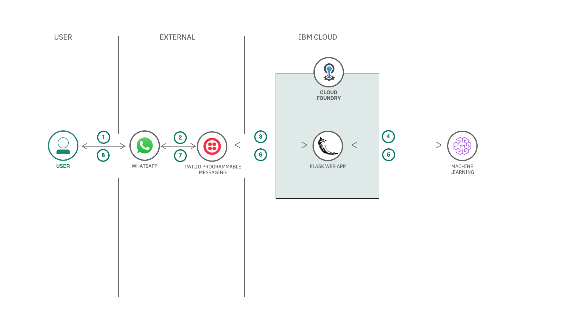

# Short Title

Build a framework that connects WhatsApp to any Watson service on IBM Cloud.

# Long Title

Build a framework that connects WhatsApp to any Watson service on IBM Cloud providing the AI capabilities to the customers.

# Author
* [Manoj Jahgirdar](https://www.linkedin.com/in/manoj-jahgirdar-6b5b33142/)
* [Rahul Reddy Ravipally](https://www.linkedin.com/in/rahul-reddy-ravipally/)
* [Srikanth Manne]()
* [Manjula Hosurmath](https://www.linkedin.com/in/manjula-g-hosurmath-0b47031)

# URLs

### Github repo

https://github.com/IBM/augment-watson-services-to-whatsapp

### Video Link

# Summary

In this Code Pattern, you will learn how to build a framework which can act as an intermediator in connecting Watson services to WhatsApp messenger, to enable mobile users to leverage watson services through a messenger app.

# Technologies

* [Python](https://developer.ibm.com/technologies/python)

* [JavaScript](https://developer.ibm.com/technologies/javascript/)

* [Machine Learning](https://developer.ibm.com/technologies/machine-learning/)

* [Artificial Intelligence](https://developer.ibm.com/technologies/artificial-intelligence/) 

# Description

As of today, there are 2.4 Billion users on WhatsApp and the number keeps climbing! For medium and large businesses, WhatsApp has Introduced the WhatsApp Business account that powers communication with customers all over the world, so they can connect with the businesses on WhatsApp in a simple, secure, and reliable way. In order to make the conversations smarter, Watson AI can be infused as the backend to deliver advanced AI capabilities to customers.

In this code pattern, you will learn to build a framework and how to connect Watson Machine Learning service, deploy a simple house price prediction model and access it from your WhatsApp messenger.

When you have completed this code pattern, you will understand how to:

* Integrate IBM Watson Services to WhatsApp.
* Deploy Application to IBM Cloud Foundry.
* Deploy Machine Learning models to Cloud Object Storage.
* Manage Machine Learning models in IBM Watson Studio.

# Flow

<!--add an image in this path-->

1. User sends a message through WhatsApp.

2. The message is redirected to Twilio Programmable Messaging service.

3. Twilio Programmable Messaging service will further forward the message to the backend application hosted on IBM Cloud.

4. The backend application interacts with the Watson Machine Learning service to get the response.

5. Watson Machine Learning service does the necessary computation and returns a response accordingly.

6. The backend application processes the response and converts it to user readable format and forwards it Twilio.

7. Twilio forwards this message as a reply on WhatsApp.

8. The user will receive this as a response from Watson Machine Learning service on WhatsApp.

# Instructions

> Find the detailed steps in the [README](https://github.com/IBM/augment-watson-services-to-whatsapp/blob/master/README.md) file.

1. Clone the repo

2. Create Watson services

3. Deploy the Server Application on IBM Cloud Foundry

4. Create Twilio service

5. Configure credentials

6. Deploy the House Price Prediction model

# Components and services

* [Cloud Foundry](https://developer.ibm.com/components/cloud-foundry/)

* [IBM Cloud](https://developer.ibm.com/components/cloud-ibm/)

* [Watson Studio](https://developer.ibm.com/components/watson-studio/)

* [Watson APIs](https://developer.ibm.com/components/watson-apis/)
